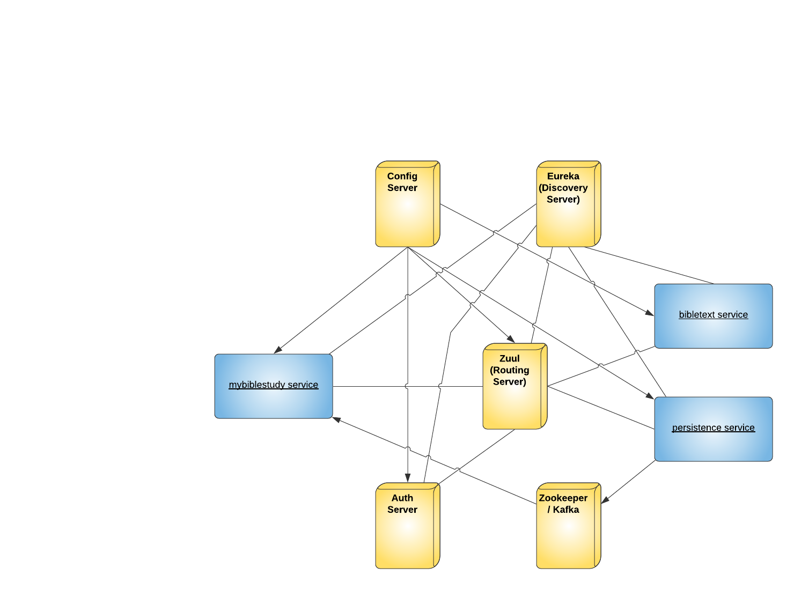

# My Bible Study Web App

Access at: 

http://mybiblestudywebapp.us-east-2.elasticbeanstalk.com/index.html
## Overview

This is a web application to facilitate collaborative study
of the Bible. Under the dashboard area users can sign up for accounts
and create notes for verses and chapters of the Bible. They
can compile their own notes into a *view* as well as add
public notes from other authors to their view. They can then
share their views. Users can access a generic view without
an account in the Client section on the frontend.

## BUILD

From parent level directory run:

```mvn clean install```

After building, to run locally navigate to `./docker` and run:

```docker-compose up```

## Architecture


### mybiblestudyservice
- Main backend service
- Provides endpoints for the frontend requests

### bibletextservices
- Serves Bible verses

### persistenceservice
- Manages data 




### Config server
- Serves configuration files to the services

### Eureka server
- Provides client discovery to the services

### Auth server
- OAuth2 server that issues JWTs.

### Zuul server
- Provides service routing and filtering

### Zooker/Kafka
- Provides event streams

### Redis
- Provides memory caching

### Elastic stack
- Provides Log aggregation. Includes **Elasticsearch**, **Logstash**, **Kibana**, and **Filebeat**

## Security


1. User logs in via Http Basic Authetnication with their username and password
at the mybiblestudyservice.

2. Mybiblestudyservice checks the username and password and if good
then it creates a user session and forwards the request to the Auth server
including the OAuth2 clientID and secret.

3. The Auth server response with a JWT. The mybiblestudyservice appends
the JWT to the user session.

4. Mybiblestudy services appens the JWT as a header to subsequent requests
to the other services.

## Schema

### Postgres - Bibles


## Postgres - Data


### Configuration

- All microservice URIs are configured via OS environment variables
- Everything else is set by the Spring Cloud Config server